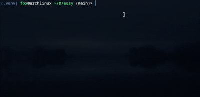

# easy

**Easy** - a simple Python library with useful functions to ease your work!

[](https://opensource.org/licenses/)


## Author

- [@Klipar](https://github.com/Klipar)

## Demo


## Installation

You can install the **Easy** library directly from GitHub using `pip`. Follow the steps below:

1. Make sure you have [Python](https://www.python.org/downloads/) (version 3.6 or higher) and `pip` installed on your system.

2. Open your terminal or command prompt and run the following command to install the library:

   ```bash
   pip install git+https://github.com/Klipar/easy.git
## Usage/Examples
#### Line bar
```Python
bar = LineProgresBar(MaxLength = 50,            # bar line length
                         text = "Loading ",     # text before the bar
                         maxWalue = 200,        # number of iterations up to 100%
                         isShowPersent = True,  # show percentages
                         isShowWalue = True)    # show values 
for i in range (200):
    bar.ShoveAndUpdate(dif_in_walue = 1)        # dif_in_walue - means the step size, standard = 1
    sleep (0.01)
```
#### Simple animation
```Python
sim = SimpleAnimation()
for i in range (30):
    inform(str = f"Progress: [ {sim.step()} ]\r", en = "")
    sleep (0.3)
```
#### Message
```Python
inform  ("Text")
warn    ("Text")
success ("Text")
failed  ("Text")
pr      ("Text")
test    ("Text")
```

### See more in the file **example.py**!
